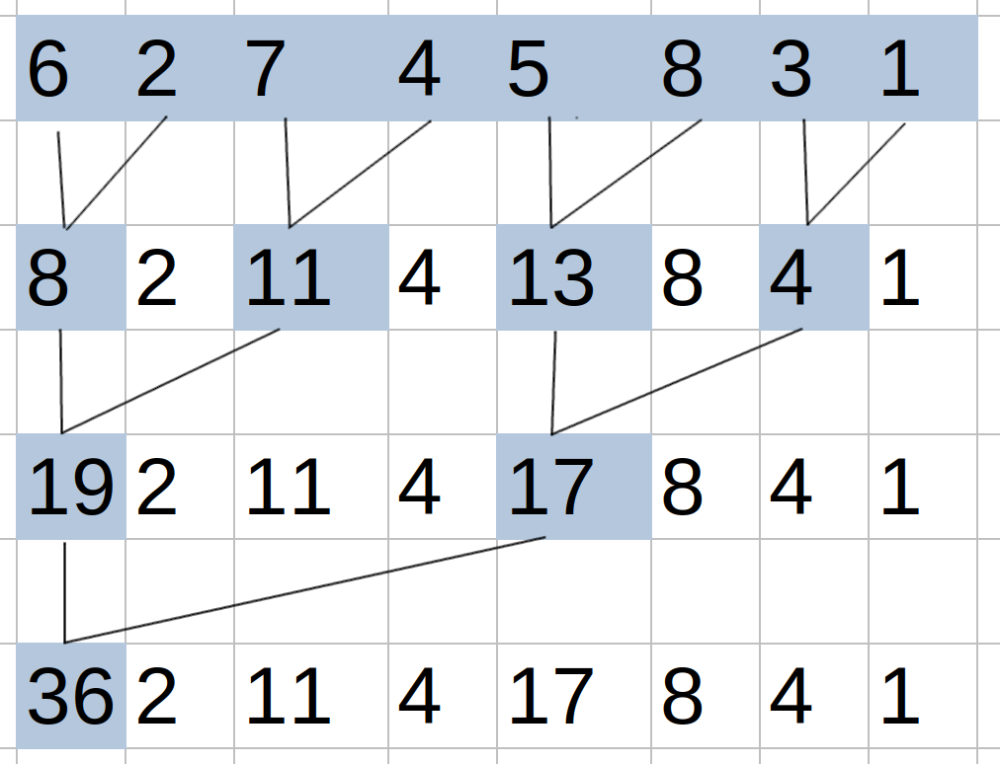
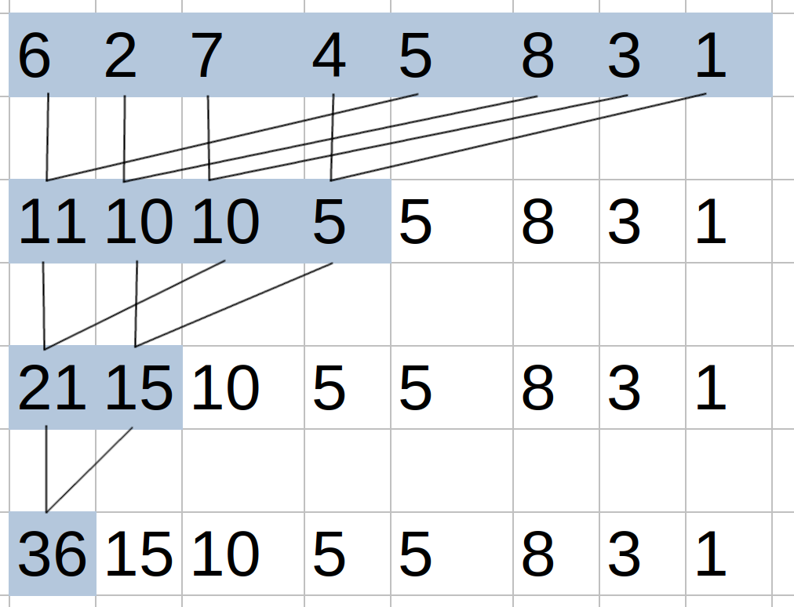

1) For the simple reduction kernel in Fig. 10.6, if the number of elements is 1024 and the warp size is 32, how many warps in the block will have divergence during the fifth iteration?  
At the start of the fifth iteration, there are $\frac{1024}{2^4} = 64$ elements to be considered. This means there are 2 threads in each warp (32 initial warps) active. Consequently, all 32 warps will have divergence.   
2) For the improved reduction kernel in Fig. 10.9, if the number of elements is 1024 and the warp size is 32, how many warps will have divergence during the fifth iteration?  
At the start of the fifth iteration, there are $\frac{1024}{2^4} = 64$ elements to be considered. Thus, 30 warps will be inactive with no divergence, and 2 warps will be active with no divergence. Therefore, no warps will have divergence.
3) Modify the kernel in Fig. 10.9 to use the access pattern illustrated below.  
See `reduction.cu`  
4) Modify the kernel in Fig. 10.15 to perform a max reduction instead of a sum reduction.  
See `reduction.cu`  
5) Modify the kernel in Fig. 10.15 to work for an arbitrary length input that is not necessarily a multiple of `COARSE_FACTOR x 2 x blockDim.x`. Add an extra parameter N to the kernel that represents the length of the input.  
See `reduction.cu`  
6) Assume that parallel reduction is to be applied on the following input array:  
[6 2 7 4 5 8 3 1]  
Show how the contents of the array change after each iteration if:  
For simplicity, addition is used as the reduction operation.  
**a)** The unoptimized kernel in Fig. 10.6 is used.  
Initial array: 6 2 7 4 5 8 3 1  

**b)** The kernel optimized for coalescing and divergence in Fig. 10.9 is used.  
Initial array: 6 2 7 4 5 8 3 1  
