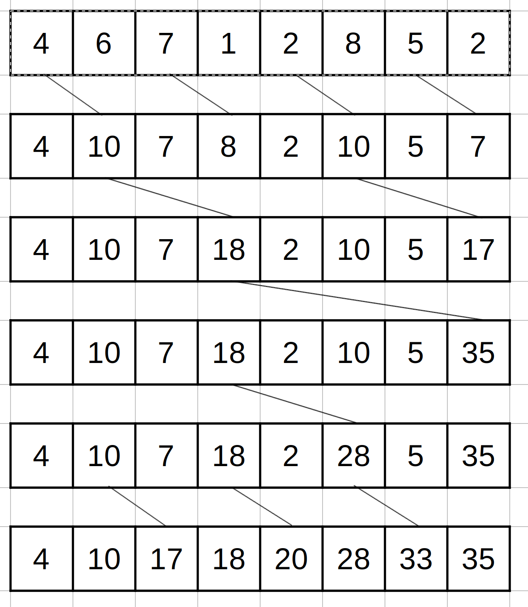

1) Consider the following array: [4 6 7 1 2 8 5 2]. Perform a parallel inclusive prefix scan on the array, using the Kogge-Stone algorithm. Report the intermediate states of the array after each step.  
  
2) Modify the Kogge-Stone parallel scan kernel in Fig. 11.3 to use double- buffering instead of a second call to __syncthreads() to overcome the write- after-read race condition.  
See `KoggeStoneDoubleBufferingInclusiveKernel()` in `parallel_scan.cu`  
3) Analyze the Kogge-Stone parallel scan kernel in Fig. 11.3. Show that control divergence occurs only in the first warp of each block for stride values up to half of the warp size. That is, for warp size 32, control divergence will occur to iterations for stride values 1, 2, 4, 8, and 16.  
We assume N is sufficiently large such that the conditions on lines 4 and 18 don't trivially cause divergence. That is, `N >= blockDim.x`. Let the warp size be W. For `blockIdx.x == 1`, the first thread has `threadIdx.x == W` by the definition of a warp. For `blockIdx.x > 1`, `threadIdx.x > W` since indices are unique and strictly increasing. Furthermore, by definition, for block k, the first thread in the block will have `blockIdx.x == k*W`. For stride size less than W, it has been established that all threads in blocks with `blockIdx.x >= 1` have `threadIdx.x >= W`, hence there will be no divergence on lines 12 and 15 for those blocks when `stride < W`. When `stride == W`, The entire first block will be inactive since their `threadIdx.x < W`. As shown, all threads in blocks with `blockIdx.x >= 1` have `threadIdx.x >= W`, hence there will be no divergence at all when `stride == W`. Every following iteration, the stride will be a multiple of `W`. Since all blocks start with a thread with threadIdx.x a multiple of W, there will be no divergence when `stride > W`. We have shown that for all values of stride, there will be no divergence in blocks with `blockIdx.x >= 1`. We have also shown that divergence will not occur in block with `blockIdx.x == 0` whenever `stride >= W`. The only remaining thing to show is that for `stride <= W/2`, there will always be divergence in block with `blockIdx.x == 0`. It is clear that when `stride == 1`, one thread will not execute line 13. When `stride == 2`, 2 threads will not execute line 14. And so on such that when `stride == W/2`, W/2 threads will not execute line 13. The next iteration, `stride == W` because `W/2 * 2 == W`, which we have already shown has no divergence for thread block 0. Thus we have shown that control divergence occurs only in the first warp of each block for stride values up to half of the warp size.  
4) For the Kogge-Stone scan kernel based on reduction trees, assume that we have 2048 elements, how many add operations will be performed?  
One or zero add operations are performed per iteration of the for-loop per thread (line 13) and exactly one outside the for-loop per thread (line 3). The number of times line 13 is executed on iteration i is $N - 2^i$. Since $2^11 = 2048$, 11 iterations will be performed. The total number of times that line 13 will be executed is then $\sum_{i=0}^{10}(N-2^i) = 20,481$. Since line 3 will be executed for each element, we then have the total number of addition operations is $22,529$. To determine this value, one could use $N \times log_2(N) + 1 = 2048 \times log_2(2048) + 1 = 2048 \times 11 + 1 = 22,529$.   
5) Consider the following array: [4 6 7 1 2 8 5 2]. Perform a parallel inclusive prefix scan on the array, using the Brent-Kung algorithm. Report the intermediate states of the array after each step.  
  
6) For the Brent-Kung scan kernel, assume that we have 2048 elements. How many add operations will be performed in both the reduction tree phase and the inverse reduction tree phase?  
The number of active threads in the reduction tree phase per iteration is $\frac{N}{2^{i+1}}$. Thus, the total number of adds performed in this phase is $\sum_{i=0}^{10}\frac{N}{2^{i+1}} = 2,047$.  
The number of active threads in the inverse reduction tree phase per iteration is $2^{i}$. Thus the total number of adds in this phase is $\sum_{i=0}^{10}2^{i} = 2,047$.  
Thus the total number of adds in the reduction tree and inverse reduction tree phases is 4,094.  
7) Use the algorithm in Fig. 11.4 to complete an exclusive scan kernel.  
See `KoggeStoneExclusiveKernel()` in `parallel_scan.cu`.  
8) Complete the host code and all three kernels for the segmented parallel scan algorithm in Fig. 11.9.  
See `ThreadCoarseningSegmentedScanKernelPhase1()`, `ThreadCoarseningInclusiveKernel()`, and `ThreadCoarseningSegmentedScanKernelPhase3()` in `parallel_scan.cu`.

Bonus:  
The stream-based scan algorithm described in 11.7 is implemented. See `StreamingKernel()` in `parallel_scan.cu`. I couldn't be bothered to compute the appropriate index for shared memory when `i > length`, so a potential improvement is computing that index and using shared memory, rather than global memory in the final phase of the kernel.