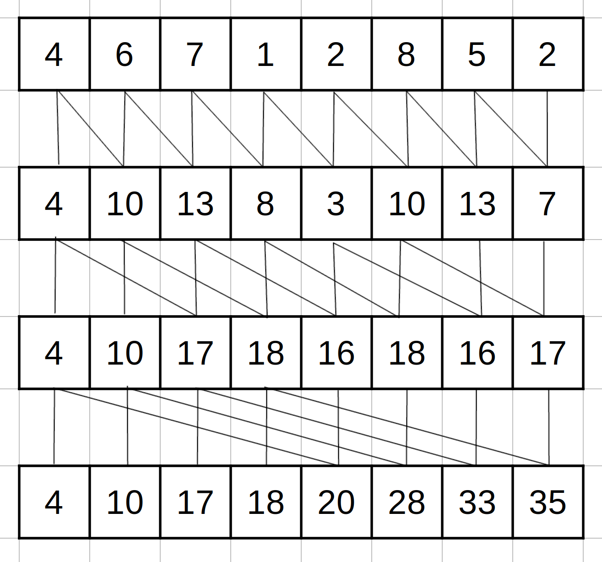

1) Consider the following array: [4 6 7 1 2 8 5 2]. Perform a parallel inclusive prefix scan on the array, using the Kogge-Stone algorithm. Report the intermediate states of the array after each step.  
  
2) Modify the Kogge-Stone parallel scan kernel in Fig. 11.3 to use double- buffering instead of a second call to __syncthreads() to overcome the write- after-read race condition.  
See `KoggeStoneDoubleBufferingKernel()` in `parallel_scan.cu`  
3) Analyze the Kogge-Stone parallel scan kernel in Fig. 11.3. Show that control divergence occurs only in the first warp of each block for stride values up to half of the warp size. That is, for warp size 32, control divergence will occur to iterations for stride values 1, 2, 4, 8, and 16.  
4) For the Kogge-Stone scan kernel based on reduction trees, assume that we have 2048 elements. Which of the following gives the closest approximation of how many add operations will be performed?  
5) Consider the following array: [4 6 7 1 2 8 5 2]. Perform a parallel inclusive prefix scan on the array, using the Brent-Kung algorithm. Report the intermediate states of the array after each step.  
6) For the Brent-Kung scan kernel, assume that we have 2048 elements. How many add operations will be performed in both the reduction tree phase and the inverse reduction tree phase?  
7) Use the algorithm in Fig. 11.4 to complete an exclusive scan kernel.  
8) Complete the host code and all three kernels for the segmented parallel scan algorithm in Fig. 11.9.  