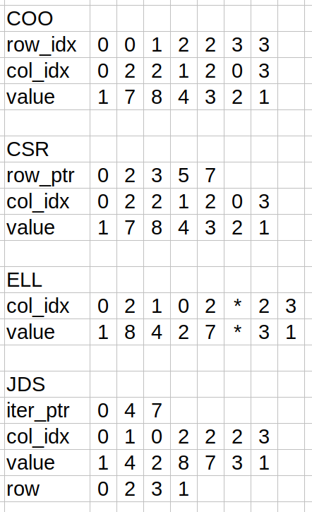

1) Consider the following sparse matrix:  
1 0 7 0  
0 0 8 0  
0 4 3 0  
2 0 0 1  
Represent it in each of the following formats: (1) COO, (2) CSR, (3) ELL, and (4) JDS.  

2) Given a sparse matrix of integers with m rows, n columns, and z nonzeros, how many integers are needed to represent the matrix in (1) COO, (2) CSR, (3) ELL, and (4) JDS? If the information that is provided is not enough to allow an answer, indicate what information is missing.  
    1) $3z$  
    2) $2z + m + 1$  
    3) There is not enough information. We need to know the maximum number of nonzeros occuring on a single row. If we call this value $z_{max,r}$, the required number of integers to represent the matrix is $2z_{max,r}m$.  
    4) There is not enough information. We need to know the maximum number of nonzeros occuring on a single row. If we call this value $z_{max,r}$, the required number of integers to represent the matrix is $2z + z_{max,r} + 1 + m$.  
3) Implement the code to convert from COO to CSR using fundamental parallel computing primitives, including histogram and prefix sum.
See `chapter_14/convert_coo_to_csr_driver.cu` and `chapter_14/spmv_utils.cu`. Note the implementation does not support matrices with more than 1024 rows, though it could be extended to do so.  
4) Implement the host code for producing the hybrid ELL-COO format and using it to perform SpMV. Launch the ELL kernel to execute on the device, and compute the contributions of the COO elements on the host.  
See `chapter_14/spmv_driver.h`, `chapter_14/spmv_utils.cu`, and `chapter_14/spmv.cu`.
5) Implement a kernel that performs parallel SpMV using a matrix stored in the JDS format.  
See `chapter_14/spmv_driver.h`, `chapter_14/spmv_utils.cu`, and `chapter_14/spmv.cu`.