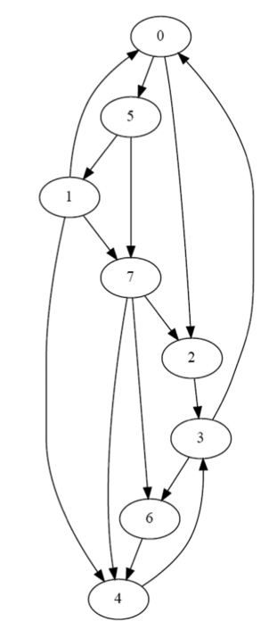
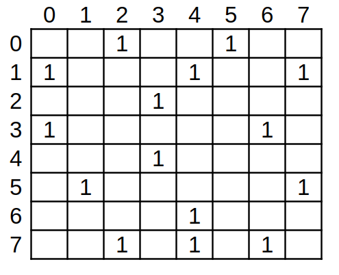
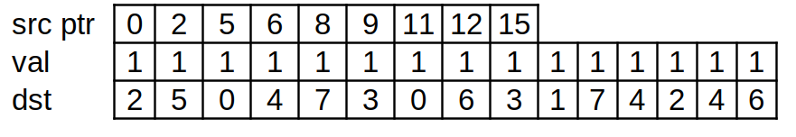

1) Consider the following directed unweighted graph:  
  
    **a)** Represent the graph using an adjacency matrix.  
      
    **b)** Represent the graph in the CSR format. The neighbor list of each vertex must be sorted.  
      
    **c)** Parallel BFS is executed on this graph starting from vertex 0 (i.e., vertex 0 is in level 0). For each iteration of the BFS traversal:  
        **i)** If a vertex-centric push implementation is used:  
            1) How many threads are launched?  
            8 in each iteration  
            2) How many threads iterate over their vertex’s neighbors?  
            in iter 1, 1, in iter 2, 2, in iter 3, 3, in iter 4, 0  
        **ii)** If a vertex-centric pull implementation is used:  
            1) How many threads are launched?  
            8 in each iteration  
            2) How many threads iterate over their vertex’s neighbors?  
            in iter 1, 7, in iter 2, 5, in iter 3, 2.
            3) How many threads label their vertex?  
            in iter 1, 2, in iter 2, 3, in iter 3, 2, in iter 4, 0  
        **iii)** If an edge-centric implementation is used:  
            1) How many threads are launched?  
            15 in each iteration  
            2) How many threads may label a vertex?  
            in iter 1, 2, in iter 2, 3, in iter 3, 4, in iter 4, 0  
        **iv)** If a vertex-centric push frontier-based implementation is used:  
            1) How many threads are launched?  
            in iter 1, 1, in iter 2, 2, in iter 3, 3, in iter 4, 2  
            2) How many threads iterate over their vertex’s neighbors?  
            in iter 1, 1, in iter 2, 2, in iter 3, 3, in iter 4, 2  
2) Implement the host code for the direction-optimized BFS implementation described in Section 15.3.  
See `VertexCentricPushPullDriver()` in `bfs_driver.cu`. Note the heuristic used to switch kernels is pretty bad as it requires using atomicAdds in the kernels which loses the idempotency of the original kernels. At least one optimization is to use privatization which does significantly improve runtime such that 100 iterations is still faster than a single iteration on CPU.  
3) Implement the single-block BFS kernel described in Section 15.7.  
See `SingleBlockVertexCentricPushBFSWithFrontiersPrivatized.cu` in `bfs.cu`.