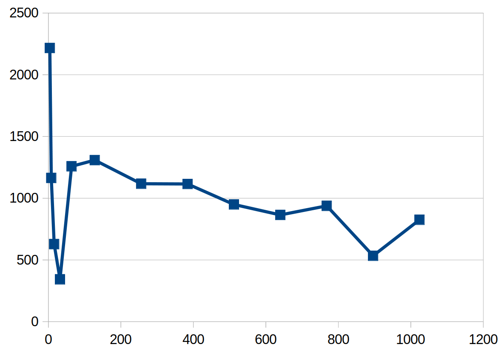

1) Loop fission splits a loop into two loops. Use the FHD code in Fig. 17.4 and enumerate the execution order of the two parts of the outer loop body: (1) the statements before the inner loop and (2) the inner loop.  
    **a)** List the execution order of these parts from different iterations of the outer loop before fission.  
        $\underbrace{1, \underbrace{2,2,\ldots,2}_{N}, 1, \underbrace{2,2,\ldots,2}_{N}, \ldots, 1, \underbrace{2,2,\ldots,2}_{N}}_{M}$  
    **b)** List the execution order of these parts from the two loops after fission.  
    $\underbrace{1,1,\ldots,1}_{M}, \underbrace{2,2,\ldots,2}_{M\times N}$  
    **c)** Determine whether the execution results in parts (a) and (b) of this exercise will be identical. The execution results are identical if all data required by a part are properly generated and preserved for its consumption before that part executes and the execution result of the part is not overwritten by other parts that should come after the part in the original execution order.  
    Yes, they are equivalent because each iteration of the first loop in part b computes a unique element of `rMu` and `iMu`, and these elements are not modified in the second loop.  
2) Loop interchange swaps the inner loop into the outer loop and vice versa. Use the loops from Fig. 17.9 and enumerate the execution order of the instances of loop body before and after the loop exchange.  
    **a)** List the execution order of the loop body from different iterations before loop interchange. Identify these iterations with the values of m and n.  
    Let $(n,m)$ indicate the values of $n$ and $m$ for a single iteration of the inner loop.  
    $(0,0), (1,0),\ldots,(N-1,0),(0,1), (1,1),\ldots,(N-1,1),\ldots,(0,M-1), (1,M-1),\ldots,(N-1,M-1)$
    **b)** List the execution order of the loop body from different iterations after loop interchange. Identify these iterations with the values of m and n.  
    $(0,0),(0,1),\ldots, (0, M-1), (1,0),(1,1),\ldots, (1, M-1),\ldots, (N-1,0),(N-1,1),\ldots, (N-1, M-1)$  
    **c)** Determine whether the execution results in parts (a) and (b) of this exercise will be identical. The execution results are identical if all data required by a part are properly generated and preserved for its consumption before that part executes and the execution result of the part is not overwritten by other parts that should come after the part in the original execution order.  
    They are identical since the body depends only on the current values of $m$ and $n$, not on the preceding values.  
3) In Fig. 17.11, identify the difference between the access to x[] and kx[] in the nature of indices used. Use the difference to explain why it does not make sense to try to load kx[n] into a register for the kernel shown in Fig. 17.11.  
x[] is indexed by n, while kx[] is indexed by m. First of all, it would not make sense to index kx[] by n since n could exceed M. But the main point is each entry of kx is loaded only once. Loading it to a register before its single usage would waste resources.

**BONUS**: Optimize the block size to use with the best performing kernel.
The best performing kernel was the one with device math functions and struct data in constant memory.
The build used for testing can be built with:  
`make release USER_DEFINES="-DUSE_STRUCT"`  
Additionally, random data can be generated by building the generator:  
`make generate_fhd_data`  
The generator is run with:  
`./generate_fhd_data <outfile> <M> <N>`  
For testing, data with M=N=100000 was generated.  
The kernel is run with:  
`./release/fhd <infile_from_generator> <kernel_to_use> [compare_to_CPU(0/1)] [run_optimization(0/1)]`
For validation, the following command was used:  
`./release/fhd data/test_large 6 1 0`  
and for optimization the following command was used:  
`./release/fhd data/test_large 6 0 1`  
which runs 10 iterations for 15 different block sizes.  
Below is the output of the test:  
| Block size: | Time (ms) |
|---|---|
|1: | 8458.13 |
|2: | 4288.04 |
|4: | 2216.88 |
|8: | 1164.04 |
|16: | 628.201 |
|32: | 342.901 |
|64: | 1258.49 |
|128: | 1308.39 |
|256: | 1117.41 |
|384: | 1115.3 |
|512: | 949.411 |
|640: | 864.568 |
|768: | 938.165 |
|896: | 533.784 |
|1024: | 825.199 |

And the following plots the time on the y-axis and the block size on the x-axis:  
  
We see that the best performing block size is 32, followed by 896. These results are somewhat surprising, especially the shape of the curve which features 2 local minima (when interpolating the line) quite far apart. This reinforces the notion that optimization is not an exact science, but rather requires actual testing. For example, a reasonable approach might have been to run an algorithm akin to gradient descent to discover a minimum, however this would have a strong chance of landing us at the suboptimal local minimum 896.