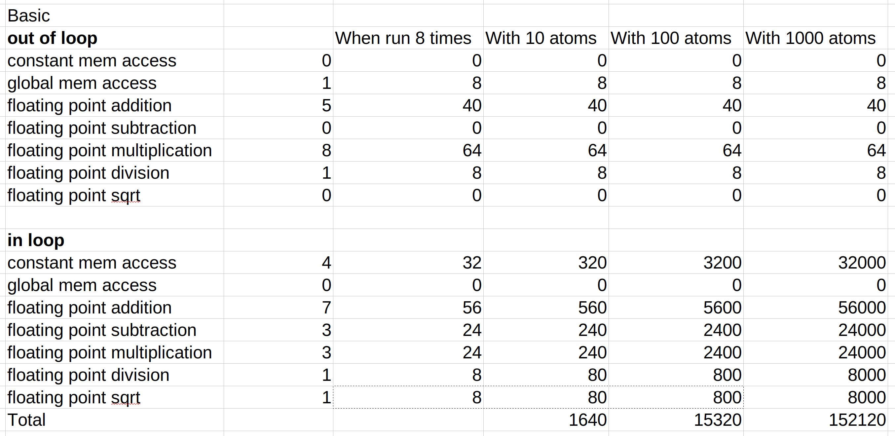
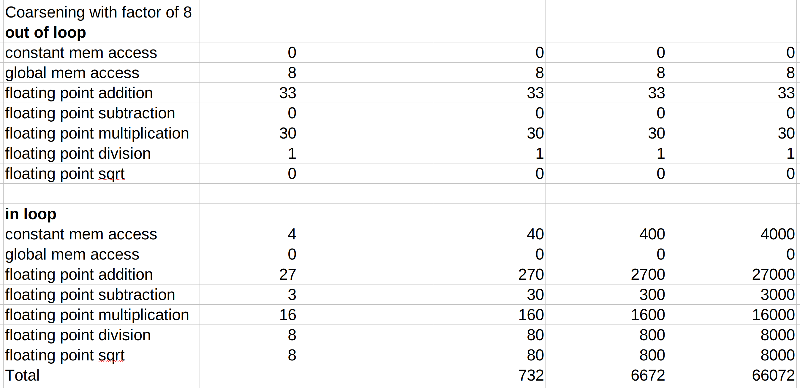
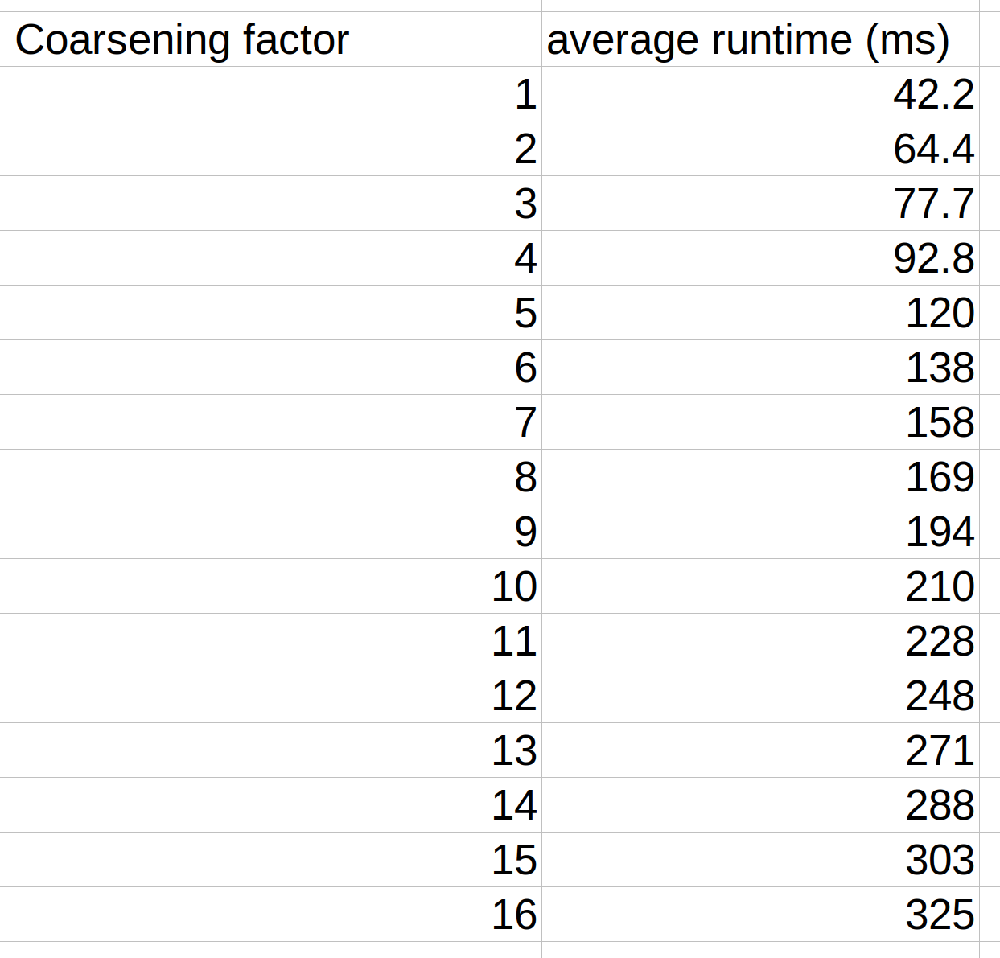
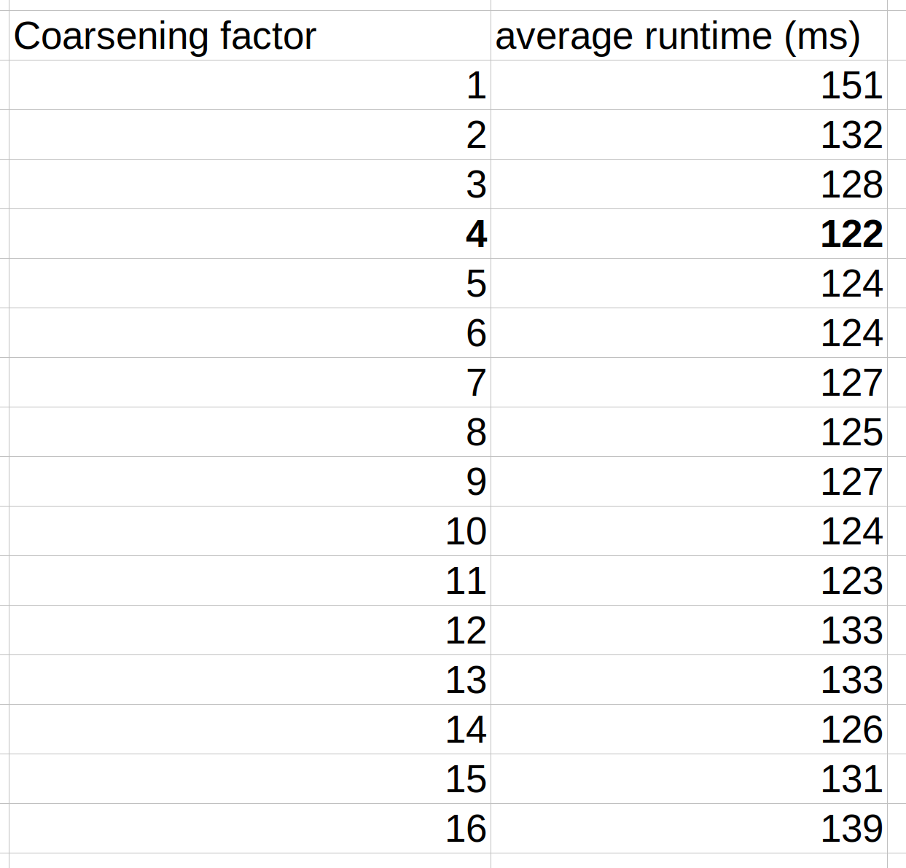

1) Complete the host code for configuring the grid and calling the kernel in Fig. 18.6 with all the execution configuration parameters.  
See `DcsDriver()` in `dcs_driver.h`.  
2) Compare the number of operations (memory loads, floating-point arithmetic, branches) executed in each iteration of the kernel in Fig. 18.8 with that in Fig. 18.6 for a coarsening factor of 8. Keep in mind that each iteration of the former corresponds to eight iterations of the latter.  

It is worth noting that the most expensive FP operations (div and sqrt) remain the same for both kernels.  
3) Give two potential disadvantages associated with increasing the amount of work done in each CUDA thread, as shown in Section 18.3.  
The following chart captures the impact of coarsening factor on runtime with the kernel using coarsening and coalesced memory accesses on a data set with 2500 atoms and a grid size of 1000 x 10 x 100:  

This result is rather surprising as it shows there is no advantage to coarsening for this kernel which is evidently not true due to the analysis in the previous question. Note the implementer has verified that the grid launched is adjusted for the coarsening factor.  
The following chart captures the impact of coarsening factor on runtime with the kernel using coarsening and coalesced memory accesses on a data set with 100 atoms and a grid size of 100000 x 32 x 100:  
  
Together, the charts show when the number of atoms in the system is large relative to the grid dimensions, it may be more efficient to use the kernel without coarsening.  
Theoretically, one potential disadvantage is that as more threads are used, more registers are required which could reduce the occupancy of the SM. It is worth noting in my implementation, dx does not need COARSEN_FACTOR copies, only 1. Furthermore, the base index is stored in a register in my implementation. The total number of registers required for my implementation with full optimizations (meaning registers are reused after variables go out of scope) is COARSEN_FACTOR + 24.  
A second disadvantage occurs if the number of threads required to compute the non-coarsened version is already quite small (able to run in parallel). In this case, the coarsened kernel is performing some extra work which could be offloaded to additional threads to run concurrently.  
4) Use Fig. 18.13 to explain how control divergence can arise when threads in a block process a bin in the neighborhood list.  
If the number of atoms in a bin is not a multiple of the number of threads in a warp, then control divergence will occur.