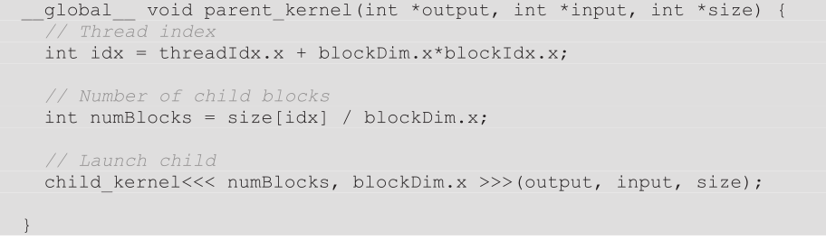

1) Which of the following statements are true for the Bezier curves example?  
**a)** If N_LINES=1024 and BLOCK_DIM=64, the number of child kernels that are launched will be 16.  
False, one child kernel is launched for every line, so 1024 kernels will be launched.  
**b)** If N_LINES=1024, the fixed-size pool should be reduced from 2048 (the default) to 1024 to get the best performance.  
Not necessarily. The default size is suitable for most purposes that don't **exceed** 2048.  
**c)** If N_LINES=1024 and BLOCK_DIM=64 and per-thread streams are used, a total of 16 streams will be deployed.  
False, a stream would be created for every thread in the parent kernel.  
2) Consider a two-dimensional organization of 64 equidistant points. It is classified with a quadtree. What will be the maximum depth of the quadtree (including the root node)?  
**a)** 21  
**b)** 4  
**c)** 64  
**d)** 16  
4  
3) For the same quadtree, what will be the total number of child kernel launches?  
**a)** 21  
**b)** 4  
**c)** 64  
**d)** 16  
4 + 16 + 64 = 84, since the stopping criteria is checked at the beginning of the kernel,  threads will still be launched after the last splitting is performed.    
4) True or False: Parent kernels can define new __constant__ variables that will be inherited by child kernels.  
False. locals are not inherited.  
5) True or False: Child kernels can access their parents’ shared and local memories.  
False. Shared and local memory is not inherited.  
6) Six blocks of 256 threads run the following parent kernel:  
  
How many child kernels could run concurrently?  
**a)** 1536  
**b)** 256  
**c)** 6  
**d)** 1  
6 since threads are added to the null stream by default and executed serially.  