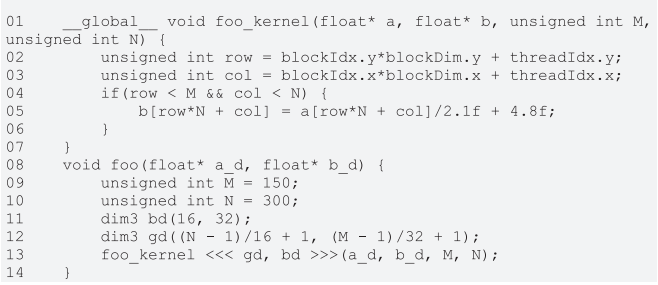

1. In this chapter we implemented a matrix multiplication kernel that has each thread produce one output matrix element. In this question, you will implement different matrix-matrix multiplication kernels and compare them.
    1. Write a kernel that has each thread produce one output matrix row. Fill in the execution configuration parameters for the design.
        ```C
        __global__
        void matMulComputeRow(float* M, float* N, float* P, int width)
        {
            int row = blockIdx.y * blockDim.y + threadIdx.y;

            if (row < width)
            {
                for (int col = 0; col < width; ++col)
                {
                    float dot_product = 0;
                    for (int idx = 0; idx < width; ++idx)
                    {
                        dot_product += M[row * width + idx] * N[idx * width + col];
                    }
                    P[row * width + col] = dot_product;
                }
            }
        }
        ```
    2. Write a kernel that has each thread produce one output matrix column. Fill in the execution configuration parameters for the design.
        ```C
        __global__
        void matMulComputeCol(float* M, float* N, float* P, int width)
        {
            int col = blockIdx.x * blockDim.x + threadIdx.x;

            if (col < width)
            {
                for (int row = 0; row < width; ++row)
                {
                    float dot_product = 0;
                    for (int idx = 0; idx < width; ++idx)
                    {
                        dot_product += M[row * width + idx] * N[idx * width + col];
                    }
                    P[row * width + col] = dot_product;
                }
            }
        }
        ```
    3. Analyze the pros and cons of each of the two kernel designs.  

        |Approach | Pros | Cons
        |---|---|---|
        | Kernel computes 1 entry | Significantly faster for large matrices if there are enough cores available (over 20x faster for 200x200 matrix) | Requires more threads 
        | Kernel computes 1 column | Fewer threads required. Potentially faster for non-square matrices with few rows. | Slower when there are more cores available.
        | Kernel computes 1 row | Fewer threads required. Potentially faster for non-square matrices with few columns. | Slower when there are more cores available.

        Interestingly, with larger square matrices, computing 1 col is 2x as fast as 1 row. Unsure why.
2. A matrix-vector multiplication takes an input matrix B and a vector C and produces one output vector A. Each element of the output vector A is the dot product of one row of the input matrix B and C, that is, $A[i] = \sum^j B[i][j] * C[j]$. For simplicity we will handle only square matrices whose elements are single-precision floating-point numbers. Write a matrix-vector multiplication kernel and the host stub function that can be called with four parameters: pointer to the output matrix, pointer to the input matrix, pointer to the input vector, and the number of elements in each dimension. Use one thread to calculate an output vector element.  
See matXVecMul.cu

3. Consider the following CUDA kernel and the corresponding host function that calls it:

    1. What is the number of threads per block?  
    512
    2. What is the number of threads in the grid?  
    61,440
    3. What is the number of blocks in the grid?  
    120
    4. What is the number of threads that execute the code on line 05?  
    45,000

4. Consider a 2D matrix with a width of 400 and a height of 500. The matrix is stored as a one-dimensional array. Specify the array index of the matrix element at row 20 and column 10:
    1. If the matrix is stored in row-major order.  
    $row * width + col = 20 * 400 + 10 = 8,010$
    2. If the matrix is stored in column-major order.  
    $col * height + row = 10 * 500 + 20 = 5,020$

5. Consider a 3D tensor with a width of 400, a height of 500, and a depth of 300. The tensor is stored as a one-dimensional array in row-major order. Specify the array index of the tensor element at x = 10, y = 20, and z = 5.  
$x * width * depth + y * depth + z = 10 * 400 * 300 + 20 * 300 + 5 = 1,206,005$