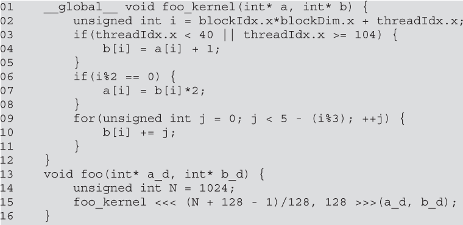

1) Consider the following CUDA kernel and the corresponding host function that
calls it:

    1) What is the number of warps per block?  
    32
    2) What is the number of warps in the grid?  
    $Total\_threads / 32 = 9*128/32 = 36$
    3) For the statement on line 04:
        - How many warps in the grid are active?  
        $\frac34 * 36 = 27$ 
        - How many warps in the grid are divergent?  
        $\frac12 * 36 = 18$
        - What is the SIMD efficiency (in %) of warp 0 of block 0?  
        100%
        - What is the SIMD efficiency (in %) of warp 1 of block 0?  
        25%
        - What is the SIMD efficiency (in %) of warp 3 of block 0?  
        75%
    4) For the statement on line 07:
        - How many warps in the grid are active?  
        36
        - How many warps in the grid are divergent?  
        36
        - What is the SIMD efficiency (in %) of warp 0 of block 0?  
        50%
    5) For the loop on line 09:
        - How many iterations have no divergence?  
        3
        - How many iterations have divergence?  
        2

2) For a vector addition, assume that the vector length is 2000, each thread calculates one output element, and the thread block size is 512 threads. How many threads will be in the grid?  
2,048

3) For the previous question, how many warps do you expect to have divergence due to the boundary check on vector length?  
2

4) Consider a hypothetical block with 8 threads executing a section of code before reaching a barrier. The threads require the following amount of time (in microseconds) to execute the sections: 2.0, 2.3, 3.0, 2.8, 2.4, 1.9, 2.6, and 2.9; they spend the rest of their time waiting for the barrier. What percentage of the threads’ total execution time is spent waiting for the barrier?  
$\frac{(3.0 - 2.0) +(3.0 - 2.3) + (3.0 - 3.0) + (3.0 - 2.8) + (3.0 - 2.4) + (3.0 - 1.9) + (3.0 - 2.6) + (3.0 - 2.9)}{2.0 + 2.3 + 3.0 + 2.8 + 2.4 + 1.9 + 2.6 + 2.9} = 0.206 = 20.6\%$

5) A CUDA programmer says that if they launch a kernel with only 32 threads in each block, they can leave out the __syncthreads() instruction wherever barrier synchronization is needed. Do you think this is a good idea? Explain.  
No. The threads may still need to communicate with each other and even though there is only one warp and all threads will execute the same instruction before moving to the next, it is not necessarily guaranteed these will be done at the same time. For example, if an SM has only 8 cores, only 8 threads can execute the instruction at a time. Additionally, the compiler may perform optimizations (such as delaying writes to shared memory) that are unexpected to the programmer. Using __syncthreads() guarantees these writes are performed at the expected time.

6) If a CUDA device’s SM can take up to 1536 threads and up to 4 thread blocks, which of the following block configurations would result in the most number of threads in the SM?  
**a.** 128 threads per block  
**b.** 256 threads per block  
**c.** 512 threads per block  
**d.** 1024 threads per block  
c

7) Assume a device that allows up to 64 blocks per SM and 2048 threads per SM. Indicate which of the following assignments per SM are possible. In the cases in which it is possible, indicate the occupancy level.  
**a.** 8 blocks with 128 threads each  
1,024 50%  
**b.** 16 blocks with 64 threads each  
1,024 50%  
**c.** 32 blocks with 32 threads each  
1,024 50%  
**d.** 64 blocks with 32 threads each  
2,048 100%  
**e.** 32 blocks with 64 threads each  
2,048 100%

8)  Consider a GPU with the following hardware limits: 2048 threads per SM, 32 blocks per SM, and 64K (65,536) registers per SM. For each of the following kernel characteristics, specify  whether the kernel can achieve full occupancy. If not, specify the limiting factor.  
**a.** The kernel uses 128 threads per block and 30 registers per thread.  
    32 blocks is 4,096 threads, so the SM could only hold 16 blocks. 2,048 threads * 30 reg/thread = 61,440 < 64K. So the kernel can achieve full occupancy  
**b.** The kernel uses 32 threads per block and 29 registers per thread.  
    Since the SM can only hold 32 blocks, at most 1,024 threads can be held for 50% occupancy. Hence, the limiting factor is the number of threads per block.  
**c.** The kernel uses 256 threads per block and 34 registers per thread.  

9)  A student mentions that they were able to multiply two 1024 x 1024 matrices
using a matrix multiplication kernel with 32 x 32 thread blocks. The student is
using a CUDA device that allows up to 512 threads per block and up to 8 blocks
per SM. The student further mentions that each thread in a thread block calculates
one element of the result matrix. What would be your reaction and why?  
I would recommend they check their output. They had not, in fact, set a new record for fastest matrix multiplication algorithm. Since the device only supports up to 512 threads per block and the student's implemented 1,024 threads per block, the code will not necessarily error out, but it definitely won't compute the correct result.