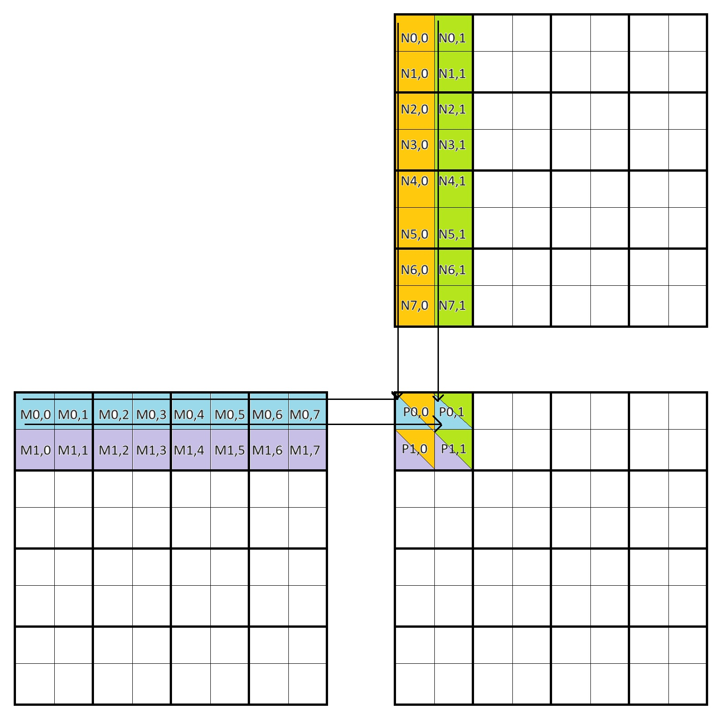
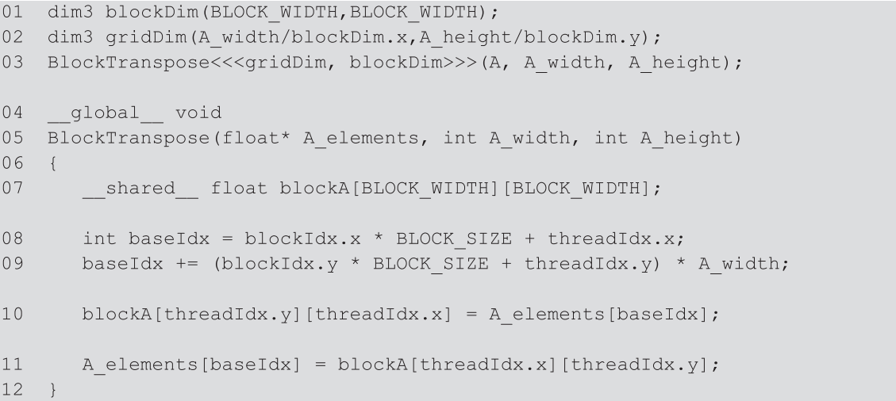
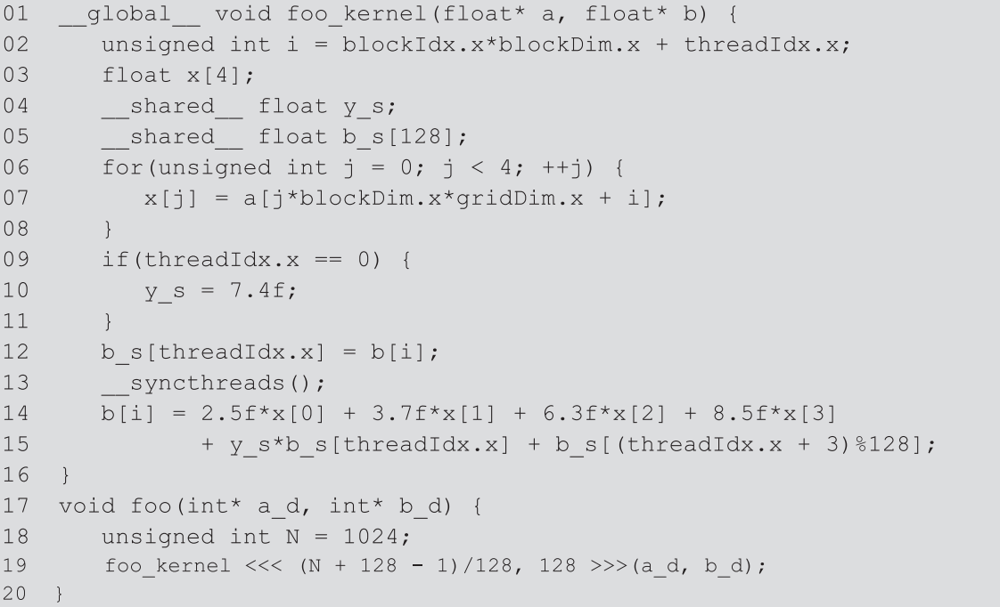
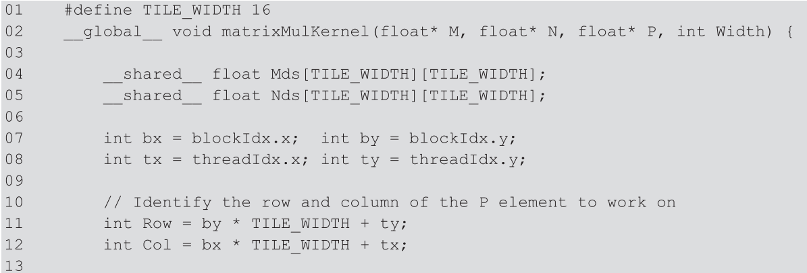
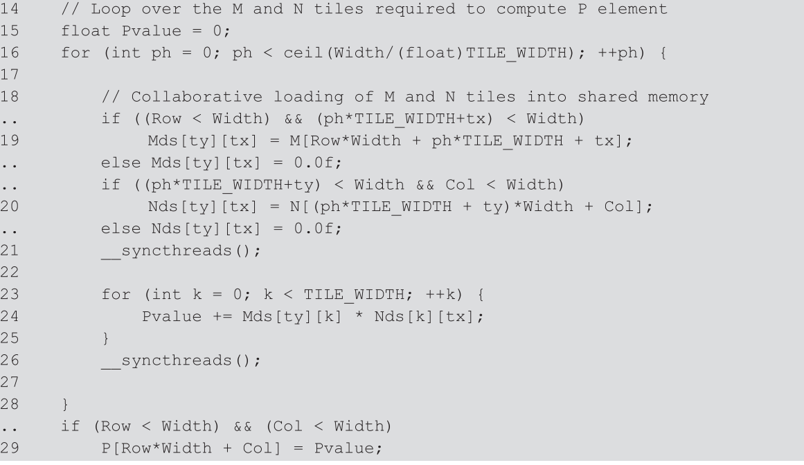

1) Consider matrix addition. Can one use shared memory to reduce the global memory bandwidth consumption? Hint: Analyze the elements that are accessed by each thread and see whether there is any commonality between threads.  
No, each thread accesses a unique element (relative to other threads) from each of the two input arrays.

2)  Draw the equivalent of Fig. 5.7 for a 8 x 8 matrix multiplication with 2 x 2 tiling and 4 x 4 tiling. Verify that the reduction in global memory bandwidth is indeed proportional to the dimension size of the tiles.  
  
Note that 4x4 tiling would be similar, just 4 rows of M and 4 columns of N contributing to a 4x4 block of P instead of 2, 2, and 2x2, respectively.

3) What type of incorrect execution behavior can happen if one forgot to use one or both __syncthreads() in the kernel of Fig. 5.9?  
Behavior resulting from violating true or false dependence. Aka read-after-write or write-after-read dependence. The former could result in reading an old value because the correct value was not written to before the read. The latter could result in a different thread reading the old value because the current thread did not yet write the correct value.

4) Assuming that capacity is not an issue for registers or shared memory, give one important reason why it would be valuable to use shared memory instead of registers to hold values fetched from global memory? Explain your answer.  
Even though registers would provide faster reads (due to being able to be operated on directly by instructions rather than requiring a load first), they are only usable by a single **thread**, so if the value must be accessed by other threads or performance improvements could be realized by sharing the values, then it must be located in shared memory which is accessible by all threads in a **block**.

5)  For our tiled matrix-matrix multiplication kernel, if we use a 32 x 32 tile, what is the reduction of memory bandwidth usage for input matrices M and N?  
The value stored to shared memory is accessed 32 times (as visualized in problem 2), hence there is a 32x reduction in loads from **global** memory, but 32 loads from shared memory. So the overall memory bandwidth remains roughly the same (across all forms of memory, that is), but the latency of memory access decreases significantly (since most loads are from the faster-to-access shared memory). I think the spirit of the question was reduction in loads from global memory, in which case the answer would be 32x.

6)  Assume that a CUDA kernel is launched with 1000 thread blocks, each of which has 512 threads. If a variable is declared as a local variable in the kernel, how many versions of the variable will be created through the lifetime of the execution of the kernel?  
A local variable is created fresh and store in the register (or local) memory for each thread. Hence there will be one version of the variable created for every thread. 1,000 * 512 = 512,000 versions.

7)  In the previous question, if a variable is declared as a shared memory variable, how many versions of the variable will be created through the lifetime of the execution of the kernel?  
Shared memory variables are stored in shared memory and created for each block. Hence, there will be 1,000 versions created.

8) Consider performing a matrix multiplication of two input matrices with dimensions N x N. How many times is each element in the input matrices requested from global memory when:  
**a.** There is no tiling?  
Once for each time a given element is accessed. For a matrix with dim N x N, this means a dot product involving row i of the first matrix will be computed N times. Hence, each elemenet will be requested from global memory **N times**.  
**b.** Tiles of size T x T are used?  
For a single tile, each element is read at most once (some are read 0 times if the row in input 1 or the col in input 2 is not involved). With a tile size of T x T, each element of an input matrix will be requested from global memory **ceil(N/T) times**.

9) A kernel performs 36 floating-point operations and seven 32-bit global memory accesses per thread. For each of the following device properties, indicate whether this kernel is compute-bound or memory-bound.  
The computation intensity is 36/(4*7) = 1.286  
**a.** Peak FLOPS=200 GFLOPS, peak memory bandwidth=100 GB/second  
With a memory bandwidth of 100 GBps, our theoretical max throughput is only 128.6 GFLOPS which is less than the device's peak throughput, making the kernel memory-bound on this device.  
**b.** Peak FLOPS=300 GFLOPS, peak memory bandwidth=250 GB/second  
With a memory bandwidth of 250 GBps, our theoretical max throughput is 250 * 1.286 = 321.5 GFLOPS, which exceeds the device's peak throughput. Hence, the kernel is now compute-bound.

10) To manipulate tiles, a new CUDA programmer has written a device kernel that will transpose each tile in a matrix. The tiles are of size BLOCK_WIDTH by BLOCK_WIDTH, and each of the dimensions of matrix A is known to be a multiple of BLOCK_WIDTH. The kernel invocation and code are shown below. BLOCK_WIDTH is known at compile time and could be set anywhere from 1 to 20.  

**a.** Out of the possible range of values for BLOCK_SIZE, for what values of BLOCK_SIZE will this kernel function execute correctly on the device?  
Those values above 5. A `BLOCK_WIDTH` of 6 implies 36 threads per block, but a warp has only 32 threads. When all threads can fit on a single warp, all threads must execute line 10 before any can execute line 11. When all threads cannot fit on a single warp, threads in warp 1 for example can move on to line 11 before those threads in warp 0 have written to `blockA` on line 10.  
**b.** If the code does not execute correctly for all BLOCK_SIZE values, what is the root cause of this incorrect execution behavior? Suggest a fix to the code to make it work for all BLOCK_SIZE values.  
The solution is to include a call to `__syncthreads()` after the write so we guarantee all threads in the block have written to `blockA` before we read. We do not need to include a `__syncthreads()` after the write to `A_elements` because each `baseIdx` is unique.

11) Consider the following CUDA kernel and the corresponding host function that calls it:  
  
**a.** How many versions of the variable i are there?  
There are $\lfloor\frac{1,024 + 128 -1}{128}\rfloor = 8$ blocks with $128$ threads each for a total of $1,024$ threads. Hence, there are $1,024$ versions of `i`  
**b.** How many versions of the array x[] are there?  
$1,024$  
**c.** How many versions of the variable y_s are there?  
`y_s` is shared so there are as many versions as there are blocks, so $8$.  
**d.** How many versions of the array b_s[] are there?  
`b_s` is shared so there are $8$ versions.  
**e.** What is the amount of shared memory used per block (in bytes)?  
A float is 4B, so $4B * 129 = 516B$  
**f.** What is the floating-point to global memory access ratio of the kernel (in OP/B)?  
Line 2 has 3 FLOPs.  
Each iteration of the for-loop starting on line 6 has 7 FLOPs (compute offset for a: 3, apply offset to a and x: 2, increment j: 1, compare j: 1) and 1 access, plus the initial assignment of j for a total of 29 FLOPs and 4 accesses.  
Lines 9-10 consistute 2 FLOPs.  
Line 12 has 2 FLOPs and 1 memory access.
Line 14-15 has 17 FLOPs.
The total is then 53 FLOPs and 5 memory accesses of size 4B = 20B memory access for a floating-point to global memory access ratio of **2.65 OP/B.**

12) Consider a GPU with the following hardware limits: 2048 threads/SM, 32 blocks/SM, 64K (65,536) registers/SM, and 96 KB of shared memory/SM. For each of the following kernel characteristics, specify whether the kernel can achieve full occupancy. If not, specify the limiting factor.  
**a.** The kernel uses 64 threads/block, 27 registers/thread, and 4 KB of shared memory/SM.  
Yes, this kernel can achieve full occupancy with 2,048 threads, 55,296 registers.
**b.** The kernel uses 256 threads/block, 31 registers/thread, and 8 KB of shared memory/SM.  
Yes, this kernel can achieve full occupancy with 2,048 threads and 63,488 registers.  
Perhaps shared memory/SM was a typo and it should read shared memory/block. In this case, a) would not reach full occupancy because of not enough shared memory (required for full occupancy would be 4*32 blocks = 128 KB). b) could still reach full occupancy because only 8 blocks * 8KB/block = 64KB shared memory would be used.

Bonus: The chapter specified 2 exercises left for the reader:

1) Revise the following kernel to compute a general matrix multiplication.

See matMulImproved.cu

2) Implement the function calculate_appropriate_SM_usage(...) used to compute the optimal number of dynamically allocated bytes required to store the relevant components of input arrays to multiplication in shared memory without exceeding the limits. It should be a function of sharedMemPerBlock obtained from cudaGetDeviceProperties.  
See matMulImprovedDynamicTileSize.cu
