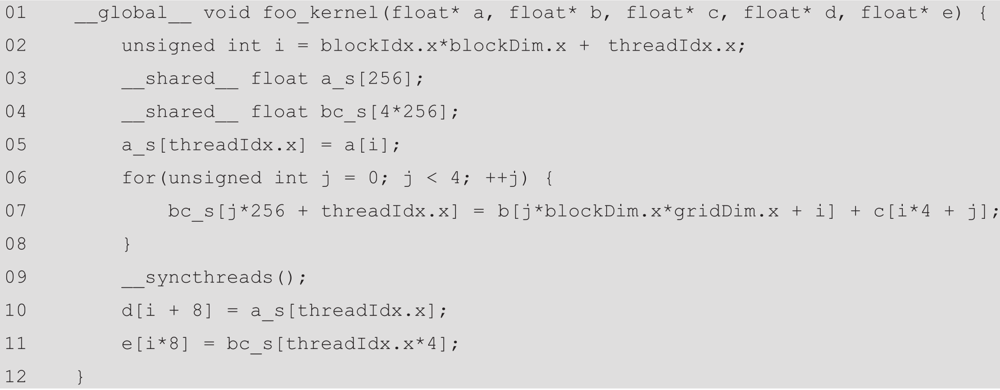

1) Write a matrix multiplication kernel function that corresponds to the design illustrated in Fig. 6.4.  
See matMulCornerTurning.cu

2) For tiled matrix multiplication, of the possible range of values for
BLOCK_SIZE, for what values of BLOCK_SIZE will the kernel completely avoid uncoalesced accesses to global memory? (You need to consider only square blocks.)  
I'm not quite certain, but I think it depends on the burst size of the hardware. If we assume each bank delivers k bytes in a burst, we would want our BLOCK_SIZE to be k / 4B. For example, if a burst delivers 128B, 32 would be the ideal BLOCK_SIZE for single-precision floating point, 16 for double-precision, and 64 for half-precision. Using this BLOCK_SIZE, an entire row of a block can be loaded from global memory.

3) Consider the following CUDA kernel:  

For each of the following memory accesses, specify whether they are coalesced or uncoalesced or coalescing is not applicable:  

    **a)** The access to array a of line 05  
    Coalesced, assuming a is stored in row-major order.  

    **b)** The access to array a_s of line 05  
    Not applicable as the array is stored in shared memory.  

    **c)** The access to array b of line 07  
    Uncoalesced because the index each iteration steps by blockDim.x*gridDim.x.

    **d)** The access to array c of line 07  
    Coalesced because the index each iteration steps by 1.

    **e)** The access to array bc_s of line 07  
    Not applicable as the array is stored in shared memory.  

    **f)** The access to array a_s of line 10  
    Not applicable as the array is stored in shared memory.  

    **g)** The access to array d of line 10  
    Coalesced because i depends on threadIdx.x which increments by 1 for adjacent threads.  

    **h)** The access to array bc_s of line 11  
    Not applicable as the array is stored in shared memory.  

    **i)** The access to array e of line 11  
    Uncoalesced because the index steps by 8 for adjacent threads.

4) What is the floating point to global memory access ratio (in OP/B) of each of the following matrix-matrix multiplication kernels?   

    **a)** The simple kernel described in Chapter 3, Multidimensional Grids and Data, without any optimizations applied.  
    Calculating row and col each performs 2 ops for a total of 4.  
    The if-block performs 2 FLOPs.  
    Each iteration of the for-loop performs 7 FLOPs, 1 to increment k, 1 to increase Pvalue, 4 to compute indices and 1 to multiply.  
    Each iteration of the for-loop performs 2 reads from global memory.  
    Writing to P performs 2 FLOPs and 1 read from global memory.  
    In the limit, the for-loop will dominate all FLOPs and memory access. Hence, the floating-point to global memory access ratio is approximately 7:2 or 3.5.

    **b)** The kernel described in Chapter 5, Memory Architecture and Data Locality, with shared memory tiling applied using a tile size of 32 x 32.  
    From lines 18-25 computing the indices will take 8 FLOPs, and Pvalue and k will be increased and Mds * Nds will be computed 32 times each. There are only 2 reads from global memory between these lines.  
    Hence, the ratio is approximately 104:2 or 52.  

    **c)** The kernel described in this chapter with shared memory tiling applied using a tile size of 32 x 32 and thread coarsening applied using a coarsening factor of 4.  
    Considering lines 25 to 37  
    Line 25: 4 FLOPs to compute index, 1 read from global memory.  
    Line 27: 4 total increments to c.  
    Line 29: 2 FLOPs/iteration * 4 iterations = 8 FLOPs.  
    Line 32: 4 FLOPs/iteration * 4 iterations = 16 FLOPs.  
    Line 32: 1 read/iteration * 4 iterations = 4 reads.  
    Line 35: Increment k 32 times/outer iteration * 4 iterations = 128 FLOPs.  
    Line 36: Similarly, 256 FLOPs.  
    Total: 416:5 or 83.2.  
