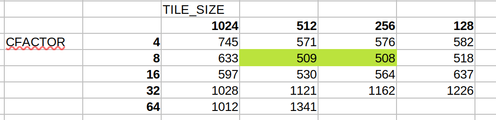
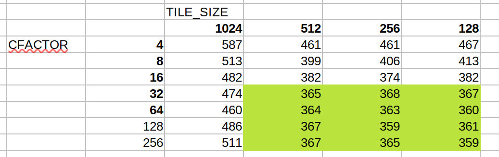
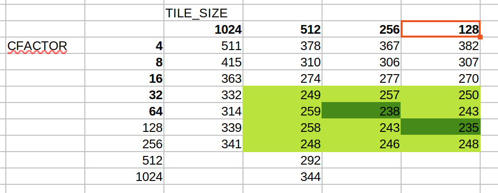

1) Assume that each atomic operation in a DRAM system has a total latency of 100 ns. What is the maximum throughput that we can get for atomic operations on the same global memory variable?  
$\frac{1 \text{op}}{100 \text{ns}} = 1e7 \frac{\text{ops}}{\text s} \rightarrow 8e7 \frac{\text{B}}{\text s}$  
2) For a processor that supports atomic operations in L2 cache, assume that each atomic operation takes 4 ns to complete in L2 cache and 100 ns to complete in DRAM. Assume that 90% of the atomic operations hit in L2 cache. What is the approximate throughput for atomic operations on the same global memory variable?  
$\frac{10 \text{ops}}{136 \text{ns}} = 7.352e7 \frac{\text{ops}}{\text s} \rightarrow 5.882e8 \frac{\text{B}}{\text s}$  
3) In Exercise 1, assume that a kernel performs five floating-point operations per atomic operation. What is the maximum floating-point throughput of the kernel execution as limited by the throughput of the atomic operations?  
$5e7$ FLOPS  
4) In Exercise 1, assume that we privatize the global memory variable into shared memory variables in the kernel and that the shared memory access latency is 1 ns. All original global memory atomic operations are converted into shared memory atomic operation. For simplicity, assume that the additional global memory atomic operations for accumulating privatized variable into the global variable adds 10% to the total execution time. Assume that a kernel performs five floating-point operations per atomic operation. What is the maximum floating-point throughput of the kernel execution as limited by the throughput of the atomic operations?  
$1e9\frac{\text{op}}{\text s} / 1.1 = 9.091e8\frac{\text{op}}{\text s}$ total atomic operations per second. Thus, total max FLOPS is $9.091e8\frac{\text{op}}{\text s} \times 5 \frac{\text{FLO}}{\text{op}} = 4.545e9$ FLOPS.
5) To perform an atomic add operation to add the value of an integer variable Partial to a global memory integer variable Total, which one of the following statements should be used?  
**a)** `atomicAdd(Total, 1);`  
**b)** `atomicAdd(&Total, &Partial);`  
**c)** `atomicAdd(Total, &Partial);`  
**d)** `atomicAdd(&Total, Partial);`  
d.  
6) Consider a histogram kernel that processes an input with 524,288 elements to produce a histogram with 128 bins. The kernel is configured with 1024 threads per block.  
**a)** What is the total number of atomic operations that are performed on global memory by the kernel in Fig. 9.6 where no privatization, shared memory, and thread coarsening are used?  
$524,288$ atomic ops.  
**b)** What is the maximum number of atomic operations that may be performed on global memory by the kernel in Fig. 9.10 where privatization and shared memory are used but not thread coarsening?  
Someone could foolishly choose to make the `blockDim == dim3(16,64,1)`. In this case, `gridDim` would need to be at least `dim3(32,768, 1, 1)` (note, `blockDim.x` cannot be 8 as this would require `gridDim.x == 65,536`). Each thread would perform 8 atomic operations on global memory, so each thread block would perform 8,192 atomic operations on global memory. Thus the maximum total is $2.684e9$ atomic operations!   
Of course, no one would actually choose such a horrible configuration, so more realistically, if `blockDim == dim3(1024, 1, 1)`, `gridDim == dim3(512,1,1)`, then each thread in a block performs 1 atomic operation on **shared memory**  and 128 threads in a block perform 1 atomic operation on **global**. Then the max total number of atomic operations on global memory is 65,536.  
**c)** What is the maximum number of atomic operations that may be performed on global memory by the kernel in Fig. 9.14 where privatization, shared memory, and thread coarsening are used with a coarsening factor of 4?  
Let us consider the optimal block configuration again. Since each thread comptues 4 entries, `gridDim == dim3(128,1,1)`. Then, the maximum number of atomic operations on global memory is only 16,384.  

Bonus:
1) Implement the kernels presented in the chapter.  
See `parallelHistogram.cu`

Tuning was performed to identify optimal values on a set of 1e8 random integers between 1 and 1000
basic kernel:  
| parameter | optimal value| values tried | notes |
|---|---|---|---|
| TILE_WIDTH | 1024 | 1024, 512, 256, 128, 64, 32, 16, 8 | It didn't have much effect, but 1024 was the best by a slim margin. When going lower than 32, performance did suffer as expected.

privatized kernel:  
| parameter | optimal value| values tried | notes |
|---|---|---|---|
| TILE_WIDTH | 512 | 1024, 512, 256, 128, 64, 32 | There was a much more significant effect here, an almost parabolic relationship where 512 and 256 performed the best and everything else got significantly worse. There was an undebugged segfault when using values lower than 128.

privatized kernel with shared memory:  
| parameter | optimal value| values tried | notes |
|---|---|---|---|
| TILE_WIDTH | 256 | 1024, 512, 256, 128, 64, 32 | The behavior was nearly identical to the privatized kernel. 256 performed just a bit better.

For the remaining, the tables present the runtime for combinations of the relevant parameters.
Coarsening kernel:  

Coarsening kernel with coalesced global memory access:

Aggregated kernel:
Note, a different data set was used for finding optimal parameters for this kernel. Specifically, an all ones dataset was used.

The following summarizes the performance of the kernels with their optimal parameters:
The following is average runtime over 1000 iterations for an optimized build with tuned parameters.
|Kernel | Average Runtime | Pros | Cons
|---|---|---|---|
|basic|61.3ms| Extremely easy to implement| Extremely inefficient|
|privatized|8.00ms|Signficantly faster while not much more difficult to implement| Requires special handling of the histogram|
|privatized with shared memory|6.94ms|A good improvement both efficiency wise and for implementation since no special handling is required | If the dataset is very large, could run into a lot of serialization|
|coarsening|4.99ms|Avoids problems of the GPU serializing blocks| Memory access patterns are suboptimal|
|coarsening with coalesced global memory access|3.63ms|Good memory access patterns| more confusing to implement|
|aggregated|4.15ms|On the right datasets, it is much faster (2.35ms)| Only performs well when there is high or no contention|

